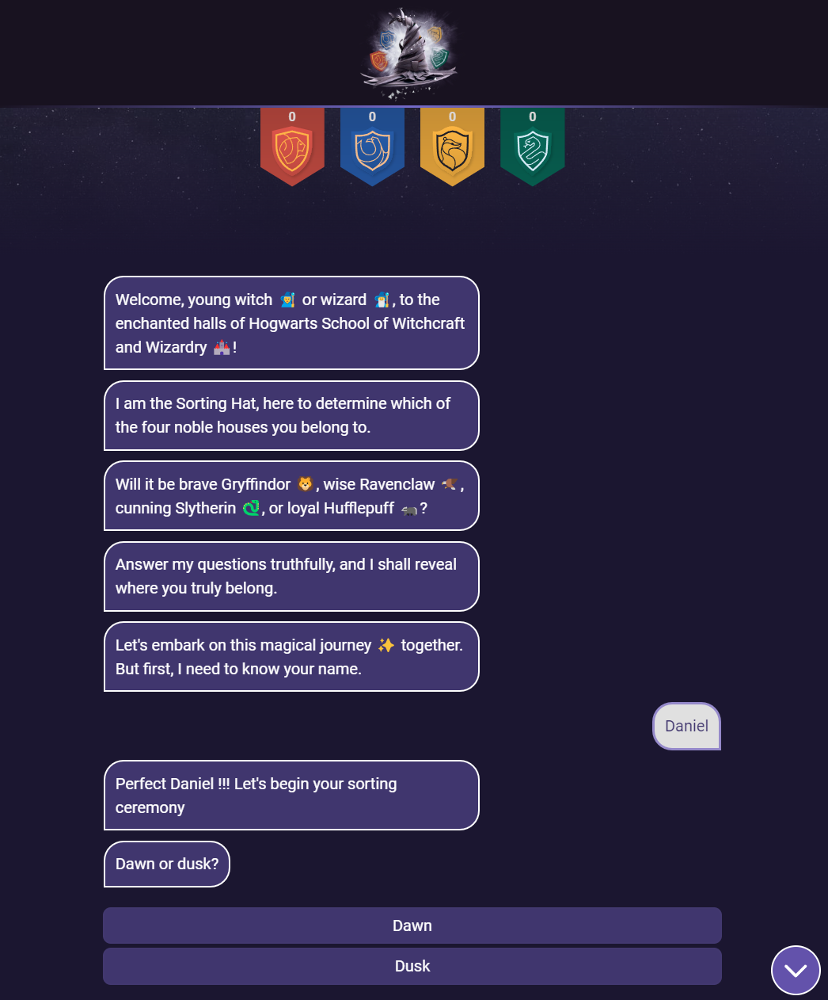
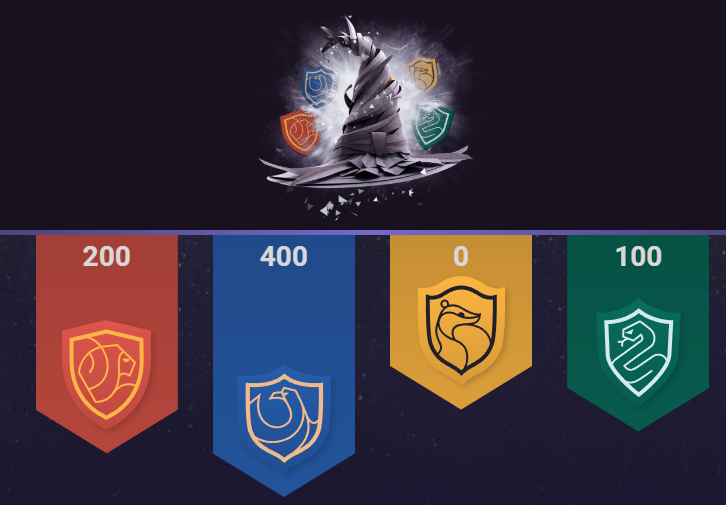

# Sorting Hat Challenge

This project is an interactive chat application developed with Vue, designed to sort users into one of four houses of a wizarding school based on their answers to a series of questions. Drawing inspiration from the magical sorting hats of wizarding stories, this application takes a modern, digital approach to the sorting process.

## Live Demo

You can access the live version of the application here: [Link to the application](https://candid-torrone-ff19ed.netlify.app/)

## Key Features

- **Interactive Chat**: The application simulates a chat conversation, making the sorting experience dynamic and engaging.
- **Custom Vue Components**: Custom Vue components, including a dynamic score counter, have been developed to cater to the specific needs of the project. The score counter features animations that visually depict the balance shifting among the different houses as questions are answered, enhancing the interactive experience.

- **Responsive Design**: Compatible with screens ranging from 320px to 3000px in width, ensuring a smooth user experience across a broad range of devices.
- **Smooth Animations**: All questions and answers animate in and out of the screen, providing a seamless and appealing user experience.

## Future Improvements

While the Sorting Hat Challenge is fully functional and engaging as it stands, there's always room for growth and enhancement. Here are some areas we're looking at for future improvements:

- **Enhance Appearance**: Overhauling the UI to make it even more visually appealing and intuitive for users.
- **Mobile Version Polish**: Further refining the mobile experience to ensure seamless usability and responsiveness on all devices.
- **Animation and Visual Bug Fixes**: Smoothing out animations and fixing any visual bugs to enhance the overall fluidity and user experience.
- **Adding More Dynamic Questions**: Introducing a broader range of questions to improve the sorting algorithm's accuracy and make the experience more personalized.
- **Localization and Internationalization**: Making the app accessible to a wider audience by supporting multiple languages.
- **User Accounts and History Tracking**: Implementing user account functionality to track past results and allow users to revisit their sorting history.

These improvements aim to enrich the user experience, broaden the app's appeal, and ensure that the Sorting Hat Challenge continues to captivate and entertain users worldwide.

## Software Requirements and Local Setup

To get the Sorting Hat Challenge up and running on your local machine, you'll need to have Node.js and npm (Node Package Manager) installed. These tools will allow you to install dependencies, build the project, and serve it locally. Here's a step-by-step guide to setting up the project:

### Prerequisites

- Ensure you have Node.js installed. You can download it from [nodejs.org](https://nodejs.org/).
- Ensure npm is installed. It comes bundled with Node.js.

### Setting Up the Project Locally

1. **Clone the Repository**

   First, clone the project repository to your local machine using Git. Open your terminal, and run the following command:

    <pre><code>git clone https://github.com/CyberDany/sorting-hat-app.git</code></pre>

2. **Navigate to the Project Directory**

    After cloning, move into the project directory that was created during the cloning process:

    <pre><code>cd sorting-hat-challenge</code></pre>

3. **Install Dependencies**

    Inside the project directory, install the project's dependencies using npm:

    <pre><code>npm install</code></pre>

4. **Serve the Project Locally**

    Once the dependencies are installed, you can serve the project locally using:

    <pre><code>npm run serve</code></pre>

    This command starts a local development server.

5. **Access the Application**

    After running the serve command, you can access the application by opening your web browser and navigating to:

    [http://localhost:8080](http://localhost:8080)

    Click the link or copy and paste it into your browser's address bar to view the project.

    By following these steps, you should have the Sorting Hat Challenge running locally on your machine, allowing you to explore and test the application in a development environment.

